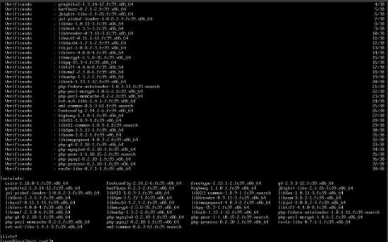

---
layout:doc
---

# Instalación de PHP y otros módulos

## Paso 5: Instalación de módulos PHP
Para permitir el procesamiento de aplicaciones PHP, instala los módulos necesarios con el siguiente comando:

```bash
sudo dnf -y install php-pear php-pdo php-mysqlnd php-pgsql php-pecl-memcache php-gd php-mbstring php-mcrypt php-xml php-json
```

### 

## Paso 6: Reinicio de Apache
Reinicia Apache para aplicar los cambios realizados:

```bash
sudo systemctl restart httpd.service
```

# Configuración adicional

## Paso 7: Directorio de alojamiento
El directorio predeterminado para alojar tus sitios web es /var/www/html.

## Paso 8: Configuración de la red
Asegúrate de que la tarjeta de red de Fedora esté configurada como solo-anfitrión.

## Paso 9: Desactivación de SELinux
Desactiva SELinux para evitar posibles problemas de configuración. Edita el archivo /etc/selinux/config y establece ```SELINUX=disabled```.

## Paso 10: Desactivación del firewall
Detén el firewall para permitir el acceso al servidor desde otras máquinas. Utiliza los siguientes comandos:

```bash
sudo systemctl stop firewalld.service
```