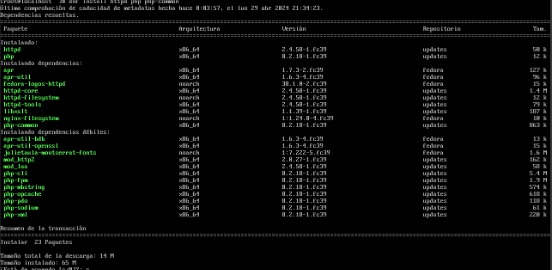
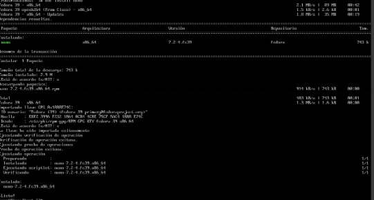
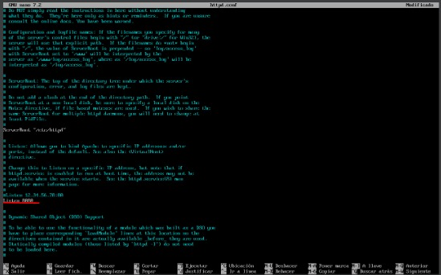
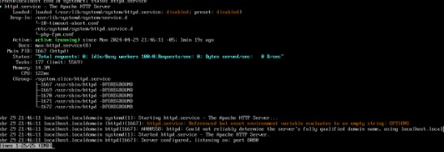

---
layout:doc
---

# Instalación de Apache y PHP


## Paso 1: Instalación de paquetes
Para instalar Apache y PHP, ejecuta el siguiente comando en la terminal de Fedora:

```bash
sudo dnf install httpd php php-common
```

### 

## Paso 2: Configuración del archivo httpd.conf
Accede al archivo de configuración de Apache para verificar y, si es necesario, cambiar el puerto predeterminado. Ejecuta el siguiente comando:

```bash
sudo nano /etc/httpd/conf/httpd.conf
```

### 

### 


Asegúrate de que el puerto 80 esté disponible y, si es necesario, cámbialo a un puerto alternativo.
(En caso de no tener el comando nano instalado lo podemos instalar mediante ```bash sudo dnf install nano ```)

## Paso 3: Iniciar el servicio Apache
Inicia el servicio Apache con el siguiente comando:

```bash
sudo systemctl start httpd.service
```

## Paso 4: Verificación del estado del servicio
Verifica que Apache esté funcionando correctamente ejecutando:

```bash
sudo systemctl status httpd.service
```
### 

