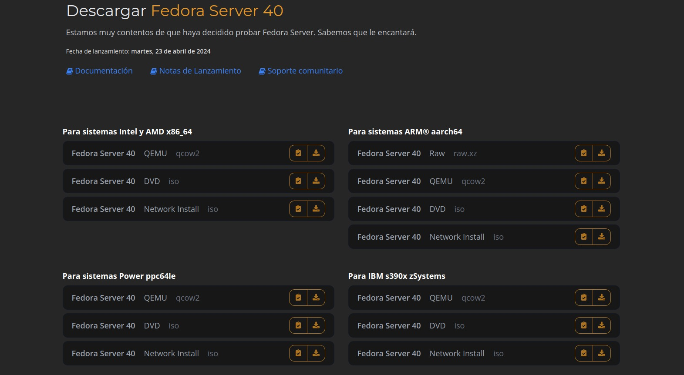

# Proceso de instalacion

## 1. Requisitos del Sistema Antes de comenzar la instalación, asegúrate de que tu sistema cumpla con los siguientes requisitos mínimos:{#paso_1}
- Procesador de 64 bits compatible con Fedora Server 39.
- Al menos 2 GB de memoria RAM (se recomiendan 4 GB o más).
- Al menos 20 GB de espacio libre en disco.
- Conexión a Internet (preferiblemente de alta velocidad) para descargar actualizaciones y paquetes adicionales durante la instalación.

## 2. Descargar la Imagen de Fedora Server 39 Descarga la imagen ISO más reciente de Fedora Server 39 desde el sitio web oficial de Fedora: https://fedoraproject.org/es/workstation/download/{#paso_2}

## 3. Crear un Medio de Arranque{#paso_3}
Crea un medio de arranque utilizando la imagen ISO descargada. Puedes usar una unidad USB o grabar la imagen en un DVD.
Para crear un medio de arranque en una unidad USB, puedes usar herramientas como Etcher o Rufus.
Si prefieres utilizar un DVD, graba la imagen ISO en un DVD virgen utilizando tu software de grabación de discos favorito.

## 4. Arrancar desde el Medio de Arranque{#paso_4}
Inserta el medio de arranque que has creado en tu sistema y arranca desde él. Esto puede implicar reiniciar tu computadora y acceder al menú de arranque o configurar la secuencia de arranque en la BIOS/UEFI para que el medio de arranque tenga prioridad.

## 5. Iniciar el Proceso de Instalación{#paso_5}
Una vez que hayas arrancado desde el medio de instalación, verás el menú de inicio de Fedora. Selecciona "Install Fedora Server 39" y presiona Enter para iniciar el proceso de instalación.

## 6. Configurar el Idioma y la Zona Horaria{#paso_6}
Selecciona tu idioma preferido y haz clic en "Continue". Luego, elige tu zona horaria y haz clic en "Done" para confirmar la configuración.

## 7. Configurar el Disco{#paso_7}
Selecciona el disco en el que deseas instalar Fedora Server 39. Puedes optar por la configuración predeterminada o personalizarla según tus necesidades. Haz clic en "Done" cuando hayas terminado de configurar el disco.

## 8. Configurar la Red{#paso_8}
Si estás conectado a una red por cable, la configuración se detectará automáticamente. Si necesitas configurar la red manualmente o si estás utilizando una conexión inalámbrica, haz clic en "Configure" y sigue las instrucciones en pantalla.

## 9. Establecer Contraseña de Root y Crear Usuario{#paso_9}
Define una contraseña segura para la cuenta de administrador (root) y crea al menos un usuario no administrativo. Estos serán necesarios para acceder al sistema una vez que la instalación esté completa.

## 10. Comenzar la Instalación{#paso_10}
Revisa la configuración de instalación y haz clic en "Begin Installation" para iniciar el proceso de instalación. Mientras se instala el sistema, puedes configurar la fecha y la hora, así como también la configuración de la cuenta de usuario.

## 11. Reiniciar el Sistema{#paso_11}
Una vez que la instalación haya finalizado, se te pedirá que reinicies el sistema. Retira el medio de instalación y haz clic en "Reboot" para reiniciar tu sistema Fedora Server 39.

