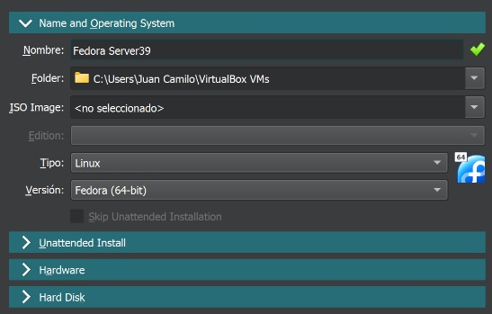
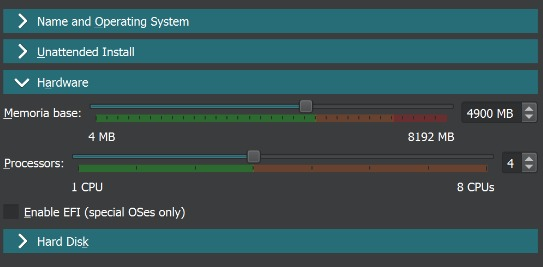
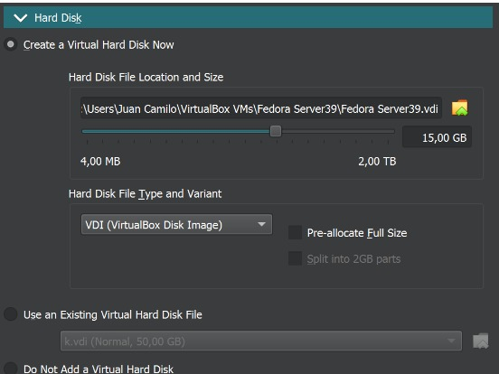
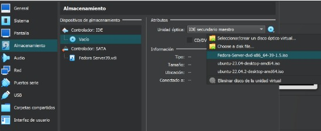
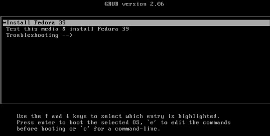
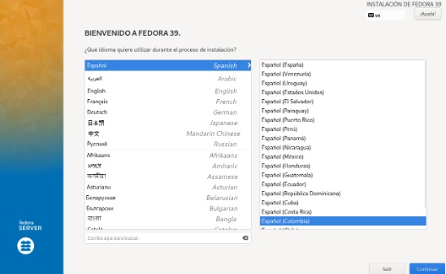
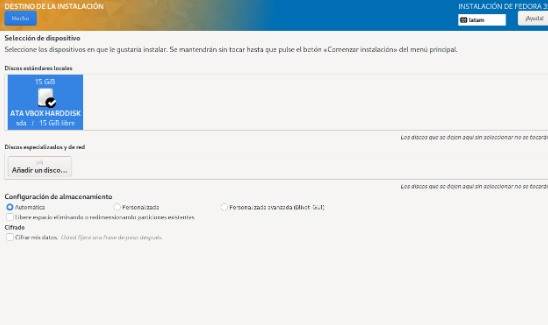
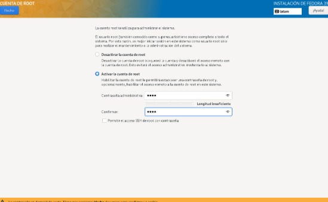
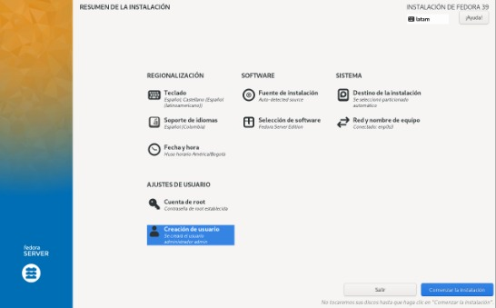

---
layout:doc
---

# A continuación se va a mostrar como se vería el proceso simulado en el software VirtualBox para la ejecución del paso a paso mencionado anteriormente:

## CREACION DE LA MAQUINA

## ASIGNACIÓN DE MEMORIA
### 

### 

### Después de haberse asignado esto vamos a la configuración para asignar el disco/ISO  de instalación:

### 

## Iniciamos la maquina para empezar con el proceso de instalación:

### 

### Selección de idioma:

### 

### Seleccionamos el destino de instalación, lo dejamos en automatico:

### 

### Creamos una contraseña para el root el cual debemos activar, al momento de crearla tratar de que cumpla con los requisitos de seguridad, en este caso se establece una contraseña simple para el manejo de la simulación del sistema:

### 

Una vez seleccionado todo esto inciamos el proceso de instalación:

### 

y una vez finalizado reiniciamos el sistema operativo y procedemos a inicar el proceso de instalación del apache